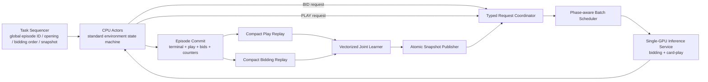

# Standard V2 单 GPU 生产架构实施计划

## 1. 文档状态

- 状态：实施中（M0、M1 已完成，下一步 M2）
- 基准日期：2026-07-19
- 目标硬件：单张 NVIDIA GPU，首个验收环境为 RTX 5070 12 GB
- 目标入口：`train_v2.py --config configs/standard_v2.yaml`
- 当前回退路径：`v2_training_mode=single_process`
- 目标拓扑：支持 standard ruleset 的 `async_single_gpu` protocol v2

本计划把生产目标分成三个发布层级：

1. **R1 Standard Core**：标准规则、完整竞叫、重发牌、角色映射、底牌揭示、出牌、bidding/card-play 联合训练、单 GPU 异步采样、checkpoint/resume。
2. **R2 Enhanced Standard**：RL+BC、human prior、style、strategy、frozen belief。
3. **R3 Continuous Pipeline**：采样与学习流水化、joint/alternating belief、curriculum、league。

R1 是当前关键路径。R2/R3 不得阻塞 R1，也不得在 R1 的协议和正确性门槛稳定前一次性合入。

## 2. 当前基线与问题

### 2.1 实测基线

| 场景 | 可训练 transition/s | 备注 |
|---|---:|---|
| Standard V2 单进程 FP32 | 约 411 | 当前生产语义基线 |
| Base V2 async 4 actors x 4 games | 约 690 | 不支持 standard ruleset |
| Base V2 async 12 actors x 8 games | 约 1,386 | 测试机稳态结果 |
| Base V2 async 12 x 8，动态 staging 容量实验 | 约 1,584 | 尚未正式实现 |

当前 B=32 bidding learner 的标量循环前后向约为 13.95 ms；批量原型约为 0.80 ms。Standard 单进程 FP16/BF16 采样吞吐低于 FP32，因此 R1 默认使用 FP32。

### 2.2 已确认的架构限制

- `async_single_gpu` 当前明确拒绝 standard bidding、belief、style、strategy、BC、league 和 curriculum。
- standard actor 状态机只存在于单进程 `_run_one_episode()`。
- bidding learner 对 minibatch 逐条调用 `forward_bidding()`。
- bidding 与 play replay 共用同一个 `batch_size` 和 step readiness 条件。
- async replay 只有 card-play compact tensor contract，没有 bidding replay contract。
- async actor 以 actor-local RNG 和任务抢占顺序驱动数据，尚未提供与 actor 调度无关的全局 episode RNG。
- 长训练按“完整采样阶段 -> 完整优化阶段”执行，尚未重叠 CPU 环境推进和 GPU learner。
- 当前 checkpoint identity 已绑定 topology、replay schema、snapshot publication 和 request ordering；任何新语义必须显式升级版本。

## 3. 设计原则与不可破坏约束

1. **一局一个策略快照**：从第一次竞叫到终局，bidding、card-play 和 belief 必须使用同一个不可变 snapshot。
2. **原子权重发布**：bidding head、card-play trunk/head，以及启用时的 belief model 必须作为一个策略版本发布。
3. **原子 episode 提交**：play replay、bidding replay、终局标签和统计必须同时可见，不能采样半局数据。
4. **重发牌隔离**：all-pass deal 的 bidding transitions 必须丢弃，不能使用后续 deal 的终局结果标注。
5. **物理座位语义**：竞叫期间记录 neutral seat，竞叫结束后再映射到 landlord roles。
6. **公开信息边界**：actor 和推理服务只接收现有 public observation contract；协议不得新增隐藏手牌泄漏。
7. **调度无关 RNG**：deal、bidding order、epsilon、policy mixture 等随机域由全局 episode ID 派生。
8. **版本不匹配时失败关闭**：未知 protocol、schema、snapshot 或 checkpoint topology 必须报错，不做猜测式兼容。
9. **先等价，再提速**：第一版 standard async 保持 collect/optimize 分阶段和 `policy_lag=0`。
10. **强度优先于吞吐**：最终指标是 time-to-target playing strength，不是单独的 transition/s。

## 4. 目标架构



### 4.1 组件责任

| 组件 | 责任 | 不负责 |
|---|---|---|
| Task Sequencer | 全局局号、opening、bidding order、snapshot、未来的 curriculum/league assignment | GPU 推理、环境推进 |
| CPU Actor | standard 环境状态机、公开特征编码、rule/warm/epsilon 行为、终局标签准备 | CUDA、参数更新、checkpoint 写入 |
| Request Coordinator | slot 生命周期、失败传播、请求类型、snapshot 校验 | 行为 RNG、训练采样 |
| Batch Scheduler | 按 `(snapshot, request_kind, action_bucket)` 聚批和公平调度 | 改变请求语义 |
| GPU Inference Service | batched bidding/card-play forward、结果发布 | 环境状态和 replay 标注 |
| Episode Committer | 完整性校验、play/bid 原子提交、统计更新 | 部分 episode 提前可见 |
| Learner | play/bid/BC/belief loss、优化器、数值保护 | actor 生命周期管理 |
| Snapshot Publisher | quiescent 或引用计数安全的原子发布 | 覆盖仍被活跃局引用的 snapshot |

## 5. 里程碑与任务

### M0：冻结目标契约与基准

目标：在改代码前确定 R1 的数学语义、性能基线和回归输入。

- [x] **SV2-001** 冻结 R1 配置矩阵：standard ruleset、learned bidding、`first_bidder_mode`、decision policy、loss 权重、FP32 默认值。
- [x] **SV2-002** 建立固定 standard deck corpus，覆盖三个 first bidder、正常竞叫、all-pass、一次/多次 redeal、max-redeal guard、炸弹和春天计分。
- [x] **SV2-003** 记录单进程参考 trace：bidding order、bidding actions/source、role mapping、card-play actions、terminal targets、transition counts。
- [x] **SV2-004** 建立统一 benchmark 输出，至少包含 games/s、play transitions/s、bid transitions/s、learner samples/s、queue p50/p95、GPU seconds、staging seconds 和 peak VRAM。
- [x] **SV2-005** 定义 protocol v2、compact bidding replay 和 snapshot publication 的版本名称。
- [x] **SV2-006** 在 checkpoint identity 中预留 standard async protocol/version 字段，并保持旧 checkpoint 失败关闭。

交付物：固定输入集、单进程 golden records、性能基线 JSON、版本契约说明。

退出门槛：参考数据可在 Docker 中重复生成；相同 seed/config 的非计时字段一致。

#### M0 实施结果（2026-07-19）

- 冻结配置与版本注册表：`douzero/training/standard_v2_contract.py`。
- 固定 corpus 与参考执行器：`benchmarks/standard_v2_reference.py`。
- Golden reference：`benchmarks/baselines/standard_v2_r1_reference.json`；M1 contract v2 与固定非零 R1 seed 的当前 digest 为 `a177bc8a30e0f9d88072a3373e178d89ff4eddf2eb74334029f4bf1e0213a3bb`。
- R1 身份拆分为训练语义 hash 与 benchmark workload hash；后者绑定完整 `TrainerConfig`、设备、world size 和执行拓扑，组合 config hash 同时覆盖两者。
- 统一基准入口：`python -m benchmarks.bench_standard_v2`。
- 单 GPU 实测基线：`benchmarks/baselines/standard_v2_r1_single_gpu.json`。
- 回归门槛：`tests/test_standard_v2_contract.py`。

当前 base async 身份固定为 protocol `1`、bidding replay schema `0`、task semantics `actor_local_task_queue_v1`、commit semantics `cardplay_count_reconciled_v1`。目标 Standard async 身份预留为 protocol `2`、bidding replay schema `1`、task semantics `global_episode_domain_rng_v2`、commit semantics `atomic_bid_play_terminal_v2`、snapshot semantics `cycle_quiescent_atomic_standard_bundle_v2`。

新 checkpoint 统一升级为 format `6`，使用 trainer identity v2 绑定完整 `TrainerConfig`；format 3/4/5 仅作为同 source SHA 下的旧字段形状兼容，不承诺跨提交恢复。缺少 M1 字段的 checkpoint 只允许默认等价的 bidding batch/cadence，未知 protocol/schema/semantics 和跨拓扑恢复均失败关闭。

本次 16 局 FP32 Standard V2 单 GPU 短基准完成 1 次参数更新：6.459 games/s、368.990 play transitions/s、12.919 bid transitions/s、241.305 learner samples/s，peak allocated VRAM 269.424 MiB。采样吞吐使用 collection wall time，learner 吞吐使用 optimization wall time。单进程路径没有推理队列和 staging 阶段，对应字段明确记录为 `null`，由 M2/M5 的 async 基准填充。

### M1：向量化 Bidding Learner

目标：独立消除 standard learner 当前最大的确定性热点，不改变模型参数或 checkpoint 模型身份。

- [x] **SV2-101** 新增 `BatchedBiddingInput`，包含 `[B, input_width]` features 和 `[B, 4]` legal mask。
- [x] **SV2-102** 新增 `BatchedBiddingOutput`，包含 `[B, 4]` logits、landlord win、expected score 和 optional uncertainty。
- [x] **SV2-103** 实现 `ModelV2.forward_bidding_batched()`；标量 `forward_bidding()` 保留轻量路径并共享 bidding head 运算。
- [x] **SV2-104** 重写 `bidding_loss()`，直接消费批量输出和批量 targets，不再 stack Python output objects。
- [x] **SV2-105** 移除 bidding output/mask 上逐样本检查；公共 model/loss 合同只使用公开 Torch API，集中式兼容层在可用且签名兼容时选择 `_assert_async`，否则同步回退。
- [x] **SV2-106** 增加独立的 `bidding_batch_size`，默认保持与旧 `batch_size` 相同以兼容旧配置。
- [x] **SV2-107** 增加 `bidding_update_interval`，使 play/bid 数据率不再强制一一同步。
- [x] **SV2-108** 增加标量/批量 output、loss、gradient、illegal-mask 和 mixed-source-policy 对照测试。
- [x] **SV2-109** 增加 B=1/32/64/128 CUDA microbenchmark。

交付物：批量 bidding API、批量 loss、独立 bidding batch 配置、性能测试。

退出门槛：FP32 output/loss/gradient 在声明容差内一致；B=32 bidding 前后向在 RTX 5070 上不高于 1.5 ms；模型 `state_dict` key 和 checkpoint architecture identity 不变。

#### M1 实施结果（2026-07-19）

- 新增 dense bidding tensor contract 与单次批量 forward；训练热路径不再逐样本构造 `BiddingModelOutput` 或 stack Python outputs。
- `bidding_loss()` 直接消费 `BatchedBiddingOutput` 和 `BatchedBiddingTargets`，并保留旧 scalar-list API wrapper；mask/action 合法性使用公开 Torch 运算的一次批量检查，零 credit batch 保持有限零梯度。
- `bidding_batch_size=None` 保留为声明式继承并由 `resolved_bidding_batch_size` 动态解析，`dataclasses.replace()` 修改 play batch 后不会遗留旧值。`bidding_update_interval` 默认 1；两个字段进入 CLI、YAML、TrainerConfig、checkpoint trainer identity 和 R1 evidence identity。
- cadence 按全部已完成 optimizer steps 推进，但只在 value/joint phase 到期；strict belief-only phase 不读取 bidding replay、不计算 bidding loss，也不增加 bidding learner samples。纯 bidding loss 与 interval 跳步的无梯度组合在构造时失败关闭。
- bidding 模型参数和 `state_dict` key 未改变；新 format 6 完整绑定 TrainerConfig，旧 format 3/4/5 只在同 source SHA 和默认等价的新字段下加载。
- 基准脚本同时报告 head forward/backward、包含 observation tensorization、targets、实际 loss、optimizer 和 diagnostics 的 learner wall time；scalar fast path 与 batched wrapper 均分开报告 eval + inference-mode FP32 的 forward-only 和完整 argmax/host-result 决策延迟，p95 使用 nearest-rank 定义。
- R1 seed 固定为非零值 `20260719`。旧的 16 局随机 workload 数字不再作为 M0/M1 可比证据；更新后的 CUDA artifact 必须绑定精确 head、镜像、环境、命令和完整 JSON。
- 固定 seed 的 16 局 FP32 baseline 为 7.897 games/s、379.048 play transitions/s、21.716 bid transitions/s、262.393 learner samples/s，peak allocated VRAM 266.845 MiB。该结果只描述当前 head，不与旧 seed/workload 的 M0 数字计算 uplift；端到端提升结论必须在同一硬件、镜像构建环境、seed 和 workload 下成对运行 base/head。
- M1 不使用 GitHub GPU workflow。目标硬件验收按仓库 `AGENTS.md` 在 `LocalServer:/opt/DouZero` 的 Docker 容器中手动执行，记录精确 source SHA、标准镜像 ID、CUDA pytest、B=32 mean/p95 门槛和完整 16 局 R1 baseline；CPU CI 继续负责可移植回归检查。

### M2：Async Standard Protocol v2

目标：建立可承载 BID 和 PLAY 的版本化 IPC 协议，暂不迁移完整 actor 行为。

- [ ] **SV2-201** 定义 `RequestKind`、`RequestMetadataV2`、`EpisodeTaskV2` 和 `EpisodeCommitV2`。
- [ ] **SV2-202** 将分组键扩展为 `(policy_snapshot, request_kind, action_bucket)`。
- [ ] **SV2-203** 保留现有 variable-action `SharedPlaySlots`，新增固定形状 `SharedBiddingSlots`。
- [ ] **SV2-204** 实现 pinned bidding stager 和 `forward_bidding_batched()` GPU dispatch。
- [ ] **SV2-205** 设计 BID/PLAY 公平策略：BID 低延迟优先，PLAY 保持吞吐，任何类型不得饥饿。
- [ ] **SV2-206** 为 BID/PLAY 分别记录 request count、microbatch size、queue p50/p95、H2D、forward、D2H 和 publish 时间。
- [ ] **SV2-207** 扩展 coordinator 的 acquire/submit/complete/fail/shutdown 状态机测试。
- [ ] **SV2-208** 注入 actor crash、超时、错误 request kind、错误 snapshot 和错误 schema，验证全局失败传播。
- [ ] **SV2-209** 保留 protocol v1 base async 路径和配置回退开关。

交付物：协议 v2、两类 shared slots、双路径 scheduler/service、协议单元测试。

退出门槛：协议测试无 slot 泄漏；所有错误在超时前传播到主进程；shutdown 后无存活 worker。

### M3：迁移 Standard Actor 状态机

目标：让 CPU actors 完整执行 bidding/redeal/reveal/play，同时保持单进程语义。

- [ ] **SV2-301** 将 `EpisodeTaskV2` 的 episode ID 改为跨周期单调递增的全局 ID。
- [ ] **SV2-302** 从 `(run_seed, global_episode_id, domain)` 派生 deal、bidding order、epsilon 和 mixture RNG。
- [ ] **SV2-303** 在主进程 Task Sequencer 中生成 opening/bidding order，避免 actor 抢占改变牌局。
- [ ] **SV2-304** 在 actor 中实现 standard bidding loop、learned BID request、rule/warm/epsilon 本地行为和 `source_policy` 记录。
- [ ] **SV2-305** 实现 all-pass 清理、redeal counter、max-redeal guard，以及 abandoned bidding transition 统计。
- [ ] **SV2-306** 竞叫结束后执行 neutral seat 到 landlord role 的映射，并将 role 写入 bidding records。
- [ ] **SV2-307** 进入现有 card-play async 请求路径，整局继续使用同一 snapshot。
- [ ] **SV2-308** 缓存非 epsilon 决策首次生成的 play bundle，终局写 replay 时不重复编码。
- [ ] **SV2-309** 扩展 completion event：play count、bid count、abandoned count、redeals、cap guard、winner、snapshot、episode ID。
- [ ] **SV2-310** 增加 1x1、2x4、12x8 actor 拓扑的固定牌局 trace 对照测试。

交付物：支持 standard ruleset 的 CPU actor、确定性任务序列器、完整竞叫统计。

退出门槛：`epsilon=0` 时，相同固定牌局的单进程与 async bidding/card-play trace、role mapping、terminal labels 和 transition counts 一致；all-pass/cap guard 不向 replay 写入污染数据。

### M4：原子 Replay、Learner 与 Checkpoint

目标：把 standard actor 的结果安全送入联合 learner，并形成可恢复的 R1 数学边界。

- [ ] **SV2-401** 定义 `CompactBiddingTransition`：features、mask、action、source、credit flag、role、targets、policy version/step、episode ID、schema hash。
- [ ] **SV2-402** 实现 bounded `CompactBiddingReplayBuffer`，支持增量插入、均匀采样和 O(1) eviction。
- [ ] **SV2-403** 为 play 和 bid records 增加 episode ID，并实现 staged -> committed 两阶段可见性。
- [ ] **SV2-404** `EpisodeCommitter` 校验 play/bid count、snapshot、schema、terminal、role 和 target 后同时提交两个 replay。
- [ ] **SV2-405** 将 learner readiness 拆分为 play/bid 条件；支持不同 batch size 和 update interval。
- [ ] **SV2-406** 联合 loss 保持每个分量的旧归一化语义，记录实际 play/bid samples per update。
- [ ] **SV2-407** snapshot 只在完整优化块结束后发布一次，第一版维持 collection 阶段内不可变。
- [ ] **SV2-408** 升级 replay schema、request ordering、actor RNG 和 snapshot publication identity。
- [ ] **SV2-409** 实现 async standard save、strict load、空 replay 边界 resume 和 shutdown。
- [ ] **SV2-410** 明确 single-process -> async 的迁移方式：第一版只允许显式 weights/optimizer warm start，不伪装成 exact resume。
- [ ] **SV2-411** 增加 N+M resume、损坏 checkpoint、cross-topology、unknown protocol 和 source SHA mismatch 测试。

交付物：双 replay 联合 learner、原子 episode commit、format/version 升级、恢复测试。

退出门槛：连续运行与 checkpoint 后恢复在声明的 deterministic 模式下得到相同非计时状态；cross-topology 加载失败关闭；故障 episode 永不进入可采样 replay。

### M5：R1 性能优化与稳定性

目标：在不改变 R1 数学语义的前提下达到生产吞吐门槛。

- [ ] **SV2-501** 保持宽 action grouping，但按 microbatch 实际最大动作数选择 power-of-two staging 容量。
- [ ] **SV2-502** 为 play learner compact replay 增加 pinned staging 和 `non_blocking=True` H2D。
- [ ] **SV2-503** 复用 actor 编码结果，测量 encode、shared write、slot read 和 replay drain 的独立成本。
- [ ] **SV2-504** 扫描 actor/game 拓扑：4x4、8x8、10x8、12x8，并记录 CPU、RAM 和队列延迟。
- [ ] **SV2-505** 扫描 play batch 64/128/256/512 与 bid batch 32/64/128。
- [ ] **SV2-506** 保持 samples/update 比率，分别评估 FP32 和大批量 BF16；FP16 不作为默认候选。
- [ ] **SV2-507** 合并 CUDA numerical guard 的成功路径同步；失败时保留详细诊断。
- [ ] **SV2-508** 评估 TF32 high precision、`torch.compile` fixed-shape bidding 和 fixed-bucket play；未通过 parity/收益门槛则保持关闭。
- [ ] **SV2-509** 连续运行至少 10 个训练周期，检查 GPU/CPU 内存增长、slot 泄漏、队列积压和 worker 健康。
- [ ] **SV2-510** 写入可重复的 target-hardware benchmark 报告。

R1 性能门槛：

- Standard async steady-state 不低于 1,000 trainable transitions/s。
- 相对 411/s 单进程基线至少提升 2.4x。
- BID 和 PLAY queue p95 均不高于 80 ms。
- 10 周期内无持续内存增长、slot 泄漏、partial episode 或 AMP fallback。
- 峰值显存保留足够余量供后续 snapshot slots 和 belief model 使用。

### M6：采样与学习流水化

目标：在 R1 phased async 稳定后重叠 CPU 环境推进和 GPU learner。

- [ ] **SV2-601** 实现 2 至 3 个 inference snapshot slots 和 generation ID。
- [ ] **SV2-602** 每个活跃 episode 获取并持有 snapshot lease，终局后释放。
- [ ] **SV2-603** publisher 只覆盖未被引用的 slot；无可用 slot 时跳过发布而不是阻塞或覆盖。
- [ ] **SV2-604** 将 learner step 切成可调度单元，BID/PLAY inference 使用高优先级调度。
- [ ] **SV2-605** 增加最大 policy lag、snapshot age、lease count 和 skipped publication 指标。
- [ ] **SV2-606** checkpoint 仅允许在 actor、request、episode commit 和 snapshot lease 全部 quiescent 时执行。
- [ ] **SV2-607** 增加 actor crash 后 lease 回收、publisher 饥饿和旧 snapshot 请求测试。
- [ ] **SV2-608** 对比 phased 与 pipelined 的吞吐、p95、GPU utilization 和 time-to-target strength。

Go/No-Go：流水化相对 R1 phased async 的端到端吞吐提升必须至少达到 15%，且固定预算训练强度不退化；否则保持 phased async 为生产默认值。

### M7：Enhanced Standard 能力恢复

这些任务在 R1 之后按下列顺序实施，每个特性单独启用、单独回滚。

- [ ] **SV2-701 RL+BC**：解除 async 拒绝；验证 compact RL replay 与独立 BC dataset、AMP retry RNG 和 checkpoint state。
- [ ] **SV2-702 Human Prior**：扩展 PLAY response schema 以返回 `prior_logit`，覆盖所有依赖 prior 的 decision mode。
- [ ] **SV2-703 Style Features**：将固定形状 public style tensor 纳入 inference/replay protocol 和 schema identity。
- [ ] **SV2-704 Strategy Features**：actor 计算 strategy tensors；记录 DP budget/fallback；评估 CPU actor 吞吐。
- [ ] **SV2-705 Strategy Auxiliary**：actor 终局生成 auxiliary labels，原子写入 play replay。
- [ ] **SV2-706 Frozen Belief**：请求和 replay 保存 public belief input；GPU 服务批量执行 frozen belief + value forward。
- [ ] **SV2-707 Joint Belief**：learner 从 replay 重建可微 belief path；value/bidding/belief 权重原子发布。
- [ ] **SV2-708 Alternating Belief**：实现 value/belief phase 调度、独立 readiness、恢复状态和指标。
- [ ] **SV2-709 Curriculum**：opening sampler 保留在主进程；Task Sequencer 下发 opening；coach labels/audit 按 episode ID 有序写入。
- [ ] **SV2-710 League**：请求路由键加入 policy ID；实现有界 GPU opponent cache、learner-seat replay 过滤和多策略 snapshot identity。

每项退出门槛：该特性的单进程/async output、label 和更新路径通过对照；关闭特性时 protocol payload、模型输出和 checkpoint identity 保持既有行为。

### M8：生产验证与发布

- [ ] **SV2-801** 运行全部 CPU Docker 单元/集成测试。
- [ ] **SV2-802** 运行 CUDA standard async end-to-end、checkpoint/resume、failure injection 和 sustained benchmark。
- [ ] **SV2-803** 使用固定 100 局执行每 PR trace regression。
- [ ] **SV2-804** 使用至少 1,000 paired full-game deals 执行生产晋级评估。
- [ ] **SV2-805** 分别报告 overall、neutral seat、landlord/farmer、bidding、score、calibration 和 latency 指标。
- [ ] **SV2-806** 用固定 wall-clock 预算比较 time-to-target strength，并保持 samples/update 比率一致。
- [ ] **SV2-807** 先以显式 feature flag canary，保留 `single_process` 和 protocol v1 回退。
- [ ] **SV2-808** 验证旧 checkpoint 拒绝、weights-only migration、rollback 和恢复手册。
- [ ] **SV2-809** 完成生产配置、运维指标、异常告警和测试报告。

## 6. 测试矩阵

| 维度 | 必测值 |
|---|---|
| Topology | single_process、async v1 base、async v2 standard |
| Actor layout | 1x1、2x4、8x8、12x8 |
| Bidding policy | rule、learned、warm mixture、epsilon、pass、max |
| Bidding order | 三个 first bidder、rotate、seeded random |
| Redeal | 无 redeal、一次、多次、max-redeal guard |
| Decision policy | pure_win，以及启用对应 head 后的 prior/risk modes |
| Precision | FP32；大批量 BF16 候选；受控 AMP fallback |
| Resume | uninterrupted、N+M、损坏 checkpoint、cross-topology、unknown schema |
| Failure | actor crash、slot timeout、queue shutdown、bad mask、bad snapshot、partial commit |
| Optional features | 每项 disabled/enabled；组合测试按发布层级增加 |

### 6.1 正确性门槛

- 固定 observation 下 scalar/batched logits、mask、action 和 loss 一致。
- `epsilon=0` 固定牌局下 single/async action trace 和 targets 一致。
- all-pass 和 cap-guard records 不进入 bidding/play replay。
- 一局所有 records 拥有相同 policy version/step/snapshot。
- actor 数量改变不改变按 global episode ID 定义的牌局、竞叫顺序和 RNG stream。
- 失败注入后没有可采样 partial episode，没有遗留 worker 或 leased slot。

### 6.2 学习质量门槛

- 保持或显式记录 `batch_size x optimizer_steps / collected_transitions`。
- 对比相同 wall-clock、相同牌局预算和相同优化样本预算。
- 生产晋级不得只依据短期 loss 或 throughput。
- full-game paired evaluation 至少 1,000 deals，并使用预先声明的 gates。
- holdout 结果不得用于自动调参。

## 7. 可观测性要求

每个训练周期至少输出：

- `games_per_second`
- `play_decisions_per_second`
- `play_transitions_per_second`
- `bid_decisions_per_second`
- `play_samples_per_second`
- `bid_samples_per_second`
- `requests_per_microbatch`，按 BID/PLAY 分开
- `queue_p50_ms`、`queue_p95_ms`，按 BID/PLAY 分开
- `slot_read_seconds`、`encode_seconds`、`replay_commit_seconds`
- `inference_gpu_seconds`、`learner_gpu_seconds`
- `policy_lag_p50/p95/max`
- `active_snapshot_leases`、`skipped_publications`
- `redeals`、`abandoned_bidding_transitions`、`max_redeals_exceeded`
- play/bid replay occupancy 和 bucket occupancy
- peak CPU RAM、pinned RAM 和 VRAM
- AMP fallback、non-finite loss/gradient 和 worker failure counts

任何按 request kind 新增的指标都必须进入长训练 summary，不能只存在于临时 profiler 日志。

## 8. 风险与缓解措施

| 风险 | 影响 | 缓解措施 |
|---|---|---|
| actor 调度改变 RNG | 数据和恢复不可复现 | global episode ID + domain-separated RNG |
| 一局跨 snapshot | bidding/play 行为不一致 | episode snapshot lease；请求严格校验 |
| partial replay | 错误标签被 learner 消费 | staged records + atomic EpisodeCommit |
| BID 请求稀疏 | 小 kernel 和长排队 | 独立 fixed slots、低延迟优先、短 age bound |
| PLAY 细桶过多 | microbatch 碎片化 | 宽 grouping + 动态 staging capacity |
| bidding/play 数据率不同 | learner readiness 卡住 | 独立 batch size 和 update interval |
| pipeline GPU 争用 | 推理 p95 恶化 | 推理高优先级、learner 分片、Go/No-Go 门槛 |
| checkpoint 语义漂移 | 静默错误恢复 | identity version 升级，cross-topology fail closed |
| belief 输入被预计算 | joint 模式无法反传 | replay 保存 public belief input，不只存 detached feature |
| league 模型过多 | VRAM/cache 抖动 | 有界 cache、policy-aware batching、最后实施 |
| 只追求吞吐 | 样本效率或强度下降 | 固定训练比率和 time-to-target gate |

## 9. 建议 PR 顺序

1. PR1：M0 基准、golden traces 和版本契约。
2. PR2：M1 batched bidding model/loss。
3. PR3：M2 protocol v2 和 BID shared slots。
4. PR4：M3 standard actor、deterministic task sequencing。
5. PR5：M4 compact bidding replay、atomic commit、checkpoint/resume。
6. PR6：M5 性能优化、长稳测试和 R1 benchmark。
7. PR7：M8 R1 canary、paired evaluation 和生产文档。
8. PR8：M6 pipeline，独立于 R1 发布。
9. 后续 PR：按 SV2-701 至 SV2-710 顺序逐项开放 enhanced features。

每个 PR 必须可单独回滚，不得同时修改 protocol、数学 loss、snapshot 语义和流水化调度四个维度。

## 10. 测试机执行要求

所有验证遵循仓库 `AGENTS.md`：先检查远程仓库状态，所有测试和依赖操作只在 Docker 中执行。

```bash
ssh LocalServer
cd /opt/DouZero
git status
```

源码、Dockerfile 或依赖变化后更新标准镜像：

```bash
docker build --progress=plain \
  --build-arg DOUZERO_GIT_SHA="$(git rev-parse HEAD)" \
  -t douzero-test:latest .
```

CPU 回归示例：

```bash
docker run --rm \
  --mount type=bind,src=/opt/DouZero/.git,dst=/workspace/DouZero/.git,readonly \
  douzero-test:latest python -m pytest -q \
  tests/test_p17_bidding.py tests/test_v2_throughput.py
```

CUDA 回归示例：

```bash
docker run --rm --gpus all \
  --mount type=bind,src=/opt/DouZero/.git,dst=/workspace/DouZero/.git,readonly \
  douzero-test:latest python -m pytest -q tests/test_standard_v2_async.py
```

新测试文件名可以调整，但必须覆盖 protocol、standard actor、atomic replay、checkpoint/resume 和 sustained GPU benchmark。测试结束后清理本任务产生的临时文件和容器，保留 `douzero-test:latest` 与构建缓存，并再次执行 `git status`。

## 11. R1 Definition of Done

R1 只有同时满足以下条件才算完成：

- `configs/standard_v2.yaml` 可使用 async protocol v2 在单 GPU 上训练。
- learned bidding、redeal、role mapping、card-play 和联合 loss 与单进程参考语义一致。
- bidding learner 已批量化，play/bid batch 配置解耦。
- replay 按 episode 原子提交，错误和 partial records 失败关闭。
- checkpoint/save/resume/shutdown 在 CUDA Docker 中通过。
- RTX 5070 稳态达到至少 1,000 trainable transitions/s 和 2.4x 单进程提升。
- 10 周期压力测试无内存、slot、worker 或 replay 泄漏。
- 固定 100 局 trace regression 通过。
- 至少 1,000 paired full-game deals 的生产晋级门槛通过。
- `single_process` 和 protocol v1 回退路径仍可用。
- 生产配置、指标、迁移、回滚和故障处理文档完整。
